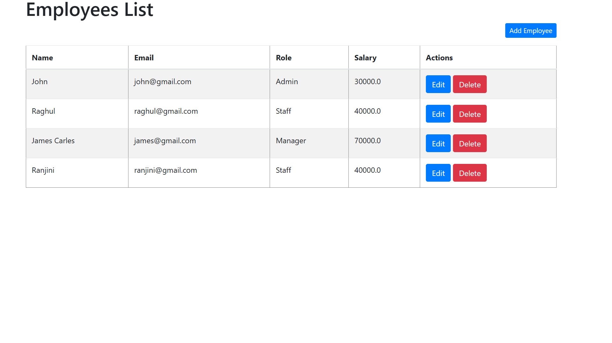
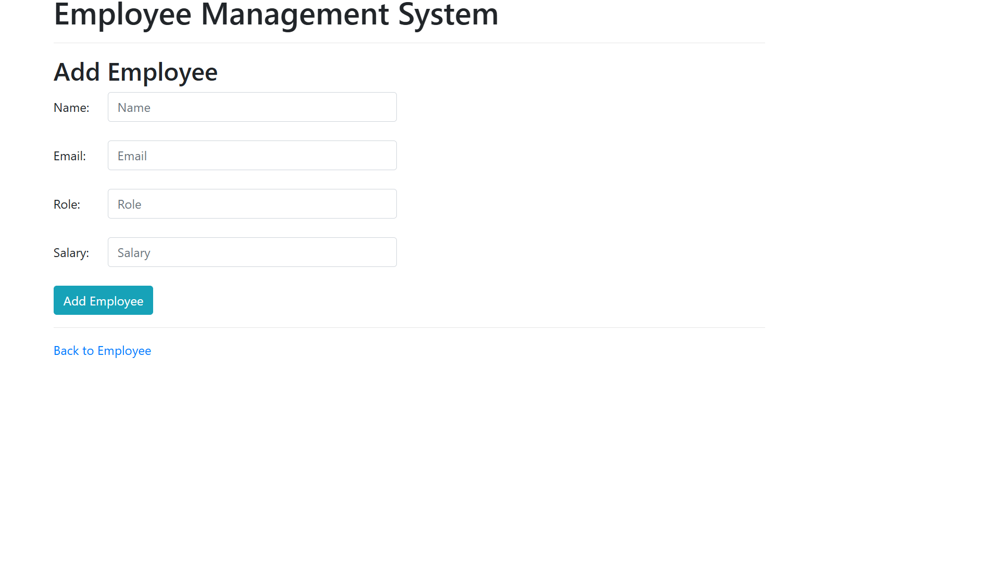
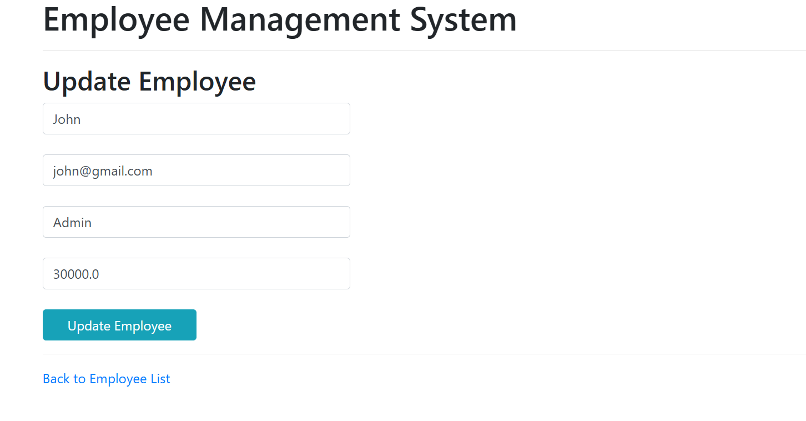

# Project Title:

Employee Management (CRUD) System

## 1. Project Description:

A Spring MVC web application for Employee Information Management with the following CRUD operations:

- Get all the employees
- Add a new employee
- Update an employee
- Delete an employee


## 2. Tech Stack:

- Java 17
- Spring Boot
- HTML
- Bootstrap
- Thymeleaf
- Spring MVC
- Spring Data JPA
- Hibernate
- Maven 
- MySql database


## 3. Installing:

i. Clone the git repo

```

```

ii. Open project folder

iii. Explore


## 4. How To Use:

i. Create Database -> demo

ii. Open project in preferred IDE (I used SpringToolsSuite4) 

iii. Run project as Spring Boot App

iv. Hibernate will automatically create a table -> employee

v. Add sample data to table using MySQL Workbench Client

vi. Open web app at localhost: 8080/

vii. Add, Update and Delete records from web app 


## 5. Demo:

### - All Employee UI



### - Add Employee UI



### - Update UI




## 6. Original Creator:

Author: Gowtham Kanagaraj
 
Github Project Name: Employee Management System

Github URL: https://github.com/RameshMF/springboot-thymeleaf-crud-pagination-sorting-webapp
